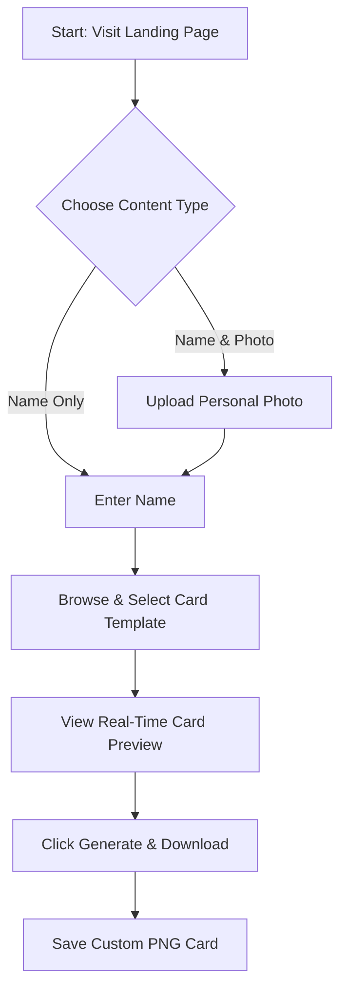
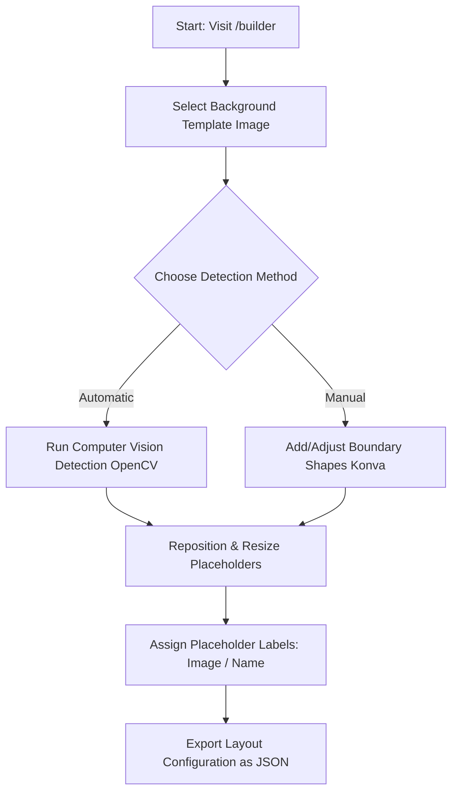

# Tahane (تهاني) - Eid Greeting Card Generator

Tahane is a web application designed to generate custom Eid al-Adha greeting cards. It allows users to personalize preset card designs with their own names and photos, previewing and downloading their customized card instantly. The platform also includes a custom visual editor that enables designers to easily map out positioning coordinates on new templates.

---

## 👥 User Flows

### 1. Greeting Card Customization Flow (For Public Users)

This is the main flow for visitors looking to create and download their custom greeting cards.



*   **Step 1: Customization Inputs**
    *   **Photo Upload:** Users upload a profile picture or photo.
    *   **Name Entry:** Users type their name to be placed on the card.
*   **Step 2: Template Selection**
    *   Users scroll through a collection of beautiful Eid card templates.
    *   If a photo is uploaded, the app automatically switches to templates designed for photo insertion. If no photo is uploaded, it shows text-only designs.
*   **Step 3: Real-Time Preview**
    *   A live preview of the card dynamically overlays the user's name and photo onto the selected template, automatically positioned and sized according to that template's configuration.
*   **Step 4: Image Generation & Download**
    *   Clicking the download button processes the card using client-side canvas rendering to output a high-resolution, shareable PNG file directly to the user's device.

---

### 2. Template Configuration Flow (For Designers)

This flow allows designers to map template layouts and generate configuration files for new designs.



*   **Step 1: Background Loading**
    *   The designer selects one of the raw template assets loaded in the workspace.
*   **Step 2: Position Mapping**
    *   **Automated Detection:** Using built-in computer vision, the editor detects predefined shapes (e.g. circles and rectangles) on the background image.
    *   **Manual Adjustment:** Designers can draw, resize, and drag shapes directly on the canvas to define exact slots for the user's name or photo.
*   **Step 3: Configuration Export**
    *   Once placement is finalized, the designer exports a JSON layout file containing the percentage-based placement data. This file is placed in the project folder to make the template immediately available on the generator page.

---

## 📁 Project Structure

Below is the conceptual layout of the project, detailing how files and directories collaborate to power the application.

```
tahane/
├── public/
│   └── templates/                 # Raw background template images (PNG & WebP formats)
├── src/
│   ├── app/                       # Page routing and backend endpoints
│   │   ├── api/
│   │   │   └── templates/         # API endpoint that serves the available templates list
│   │   ├── builder/               # Designer portal (/builder page)
│   │   ├── card/[id]/             # View and share paths for created cards
│   │   ├── view/[id]/             # Direct viewing page for cards
│   │   ├── layout.tsx             # Global application layout and fonts
│   │   └── page.tsx               # Main landing page (Eid card generator)
│   ├── components/                # Reusable UI components
│   │   ├── builder/
│   │   │   └── BuilderEditor.tsx  # Visual drag-and-drop editor canvas
│   │   ├── CardPreview.tsx        # Live card renderer with name and image overlays
│   │   ├── DownloadButton.tsx     # Canvas-based high-res image exporter
│   │   ├── ImageUpload.tsx        # Image selector, cropper, and drag-and-drop area
│   │   ├── NameInput.tsx          # Name input field with custom styles
│   │   ├── TemplateSelector.tsx   # Card design carousel selector
│   │   ├── ShareButton.tsx        # Card sharing utility
│   │   ├── Navbar.tsx             # Navigation bar header
│   │   └── Footer.tsx             # Page footer with copyrights
│   ├── data/                      # Templates listing logic and JSON layout configurations
│   │   ├── templates.ts           # Scan and parse template images and configurations
│   │   └── *__config.json          # Position mappings for each design template
│   ├── services/                  # External services integration
│   │   └── supabase.ts            # Supabase database client instance
│   └── types/                     # Shared TypeScript interface definitions
│       └── index.ts               # Core model definitions (Template, CardData, PositionConfig)
```

---

## ✉️ Contact

For any questions, feedback, or inquiries, please contact:
* **Email:** [mahmoudfalous@gmail.com](mailto:mahmoudfalous@gmail.com)
